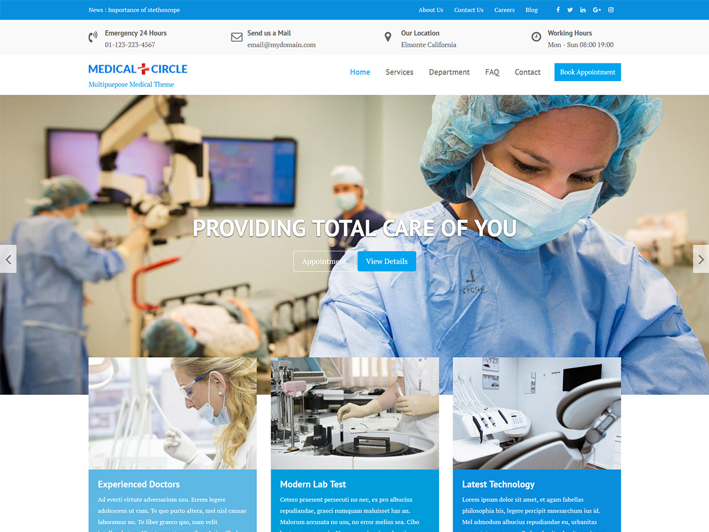

# Medical Circle

**Contributors:** acmethemes  
**Requires at least:** 6.6  
**Tested up to:** 7.0  
**Requires PHP:** 7.4  
**Stable tag:** 4.0.0  
**License:** GPLv2 or later  
**License URI:** https://www.gnu.org/licenses/gpl-2.0.html  

> 

Medical Circle is a versatile WordPress theme built for hospitals, clinics, medical practices, and healthcare professionals. It works beautifully for dental clinics, veterinary practices, nursing homes, and specialist consultations — with dedicated sections for services, doctors, and patient information.

## Features

- **Featured slider** — showcase facilities, services, and health campaigns
- **Up to four-column layouts** — flexible grids for departments and team
- **Custom header & background** — build trust with professional branding
- **Page builder compatible** — design with Elementor, Beaver Builder, SiteOrigin
- **Custom widgets** — appointment booking, service highlights, and more
- **One-click demo import** — get started instantly
- **WooCommerce compatible** — sell health products or booking services
- **Footer widgets** — contact, hours, departments, and emergency info
- **Custom colors** — match your medical brand
- **Translation ready** — .pot file included
- **RTL support** — right-to-left language compatible
- **SEO friendly & responsive** — reach patients on any device

## Installation

1. Download the theme zip file.
2. In your WordPress admin, go to **Appearance → Themes**.
3. Click **Add New** → **Upload Theme**.
4. Select the zip file and click **Install Now**.
5. Click **Activate**.

## Frequently Asked Questions

### How do I import demo content?

Install the **Acme Demo Setup** plugin and select the Medical Circle demo from the import screen.

### How do I customize the theme?

Go to **Appearance → Customize** — all layout, color, slider, and widget options are available there.

## Credits

Medical Circle is built on [Underscores](https://underscores.me/) and licensed under GPLv2 or later. It bundles the following third-party resources:

- [Google Fonts](https://fonts.google.com/) — Apache License 2.0
- [Font Awesome](https://fontawesome.com/) — MIT / SIL OFL 1.1
- [normalize.css](https://necolas.github.io/normalize.css/) — MIT
- [Bootstrap](http://getbootstrap.com/) — MIT
- [Isotope](https://isotope.metafizzy.co/) — GPLv3
- [Magnific Popup](https://github.com/dimsemenov/Magnific-Popup) — MIT
- [Theia Sticky Sidebar](https://github.com/WeCodePixels/theia-sticky-sidebar) — MIT
- [Breadcrumb Trail](https://github.com/justintadlock/breadcrumb-trail) — GPLv2+
- [TGM Plugin Activation](http://tgmpluginactivation.com/) — GPLv2+
- [html5shiv](https://github.com/afarkas/html5shiv) — MIT
- [Respond.js](https://github.com/scottjehl/Respond) — MIT
- [Waypoints](https://github.com/imakewebthings/waypoints/) — MIT
- [WOW](https://github.com/matthieua/WOW) — MIT
- [Slick](https://github.com/kenwheeler/slick/) — MIT

---

[Support](https://www.acmethemes.com/supports/) &middot; [Acme Themes](https://www.acmethemes.com)
